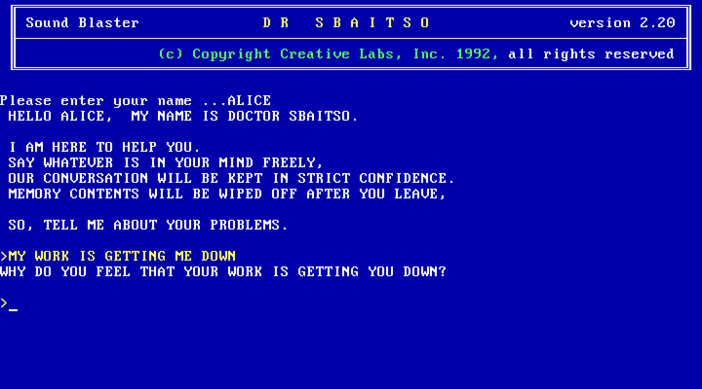

# Dr. Sbaitso Recreated

> The Sound Blaster "AI therapist" from 1990-1992, rebuilt for the web: its original
> screen and behaviour, with Google Gemini for open conversation and speech.

[](https://dr-sbaitso-recreated.vercel.app)
[](https://github.com/doublegate/DrSbaitso-Recreated/actions/workflows/ci.yml)

-3178C6?logo=typescript)
[](LICENSE)



Type your name, and DOCTOR SBAITSO greets you in his flat 8-bit voice and asks about
your problems, just like the DOS program that shipped with Creative Labs sound cards.

**Try it:** <https://dr-sbaitso-recreated.vercel.app>

## Two ways to use it

- **Classic screen** (the default) recreates v2.20 as measured from the original
  running in DOSBox: the 80x25 VGA text screen and font, the banner, the greeting,
  HELP, CALC, SAY, R, the dot commands, the parity-error flood and the
  `<C>ontinue <N>ew patient <Q>uit` menu. The commands run locally; only open
  conversation goes to the model.
- **Enhanced mode** (**Alt+Shift+X**, or `?mode=enhanced`) adds four more classic
  computer personalities, each with its own local engine and voice: ELIZA (the 1965
  script, entirely offline), HAL 9000, JOSHUA/WOPR (with tic-tac-toe) and PARRY.
  It also has your own characters, themes, visualisations, templates, export,
  sound packs, voice input, and opt-in conversation history with optional cloud sync.

## Features

- **The original's voice, approximated from measurements**: Gemini speech
  resampled to 8,475 Hz, 8-bit with sample-and-hold, pitch flattened like the 1992
  voice. Four audio modes and three voice profiles. HAL and JOSHUA get their own
  audio chains.
- **Faithful behaviour**: local engines reproduce what the originals did
  mechanically; the model only fills in open conversation
  ([ADR-0003](docs/adr/0003-hybrid-local-engines.md)).
- **Private by default**: memory is wiped when you leave, as the original promised.
  Turn on SAVE HISTORY to keep conversations in your browser.
- **Accessible and installable**: keyboard shortcuts, screen-reader support, high
  contrast and font scaling; installs as a PWA. Offline, the app and the local
  engines still run (ELIZA fully), but model replies and speech need the network.

See [docs/FEATURES.md](docs/FEATURES.md) and
[docs/KEYBOARD_SHORTCUTS.md](docs/KEYBOARD_SHORTCUTS.md).

## Quick start

Requires Node.js 22.12+ (24 recommended) and a [Gemini API key](https://aistudio.google.com/apikey).

```bash
git clone https://github.com/doublegate/DrSbaitso-Recreated.git
cd DrSbaitso-Recreated
npm ci
cp .env.example .env.local   # then set GEMINI_API_KEY
npm run dev                  # http://localhost:3000
```

| Command | Purpose |
|---|---|
| `npm run dev` | Dev server, including the `/api` functions |
| `npm run build` / `npm run preview` | Production build and local preview |
| `npm run test:run` | Unit and integration tests (Vitest) |
| `npm run test:e2e` | End-to-end tests (Playwright, `/api` mocked) |
| `npm run lint` / `npm run typecheck` / `npm run format:check` | oxlint, TypeScript (strict), Prettier |
| `npm run check:secrets` | Fails if the build contains anything shaped like an API key |

## How it works

```
Browser (React SPA)                         Vercel Functions                  Google Gemini
 classic screen | Enhanced mode
 local engines (sbaitso, eliza, ...)
   open conversation  ── POST /api/chat ──▶ validate, rate-limit, persona ──▶ gemini-3.8-flash
   speech             ── POST /api/tts ───▶ voice + style, PCM16 24 kHz  ──▶ gemini-3.8-flash-tts
 Web Audio voice chains                     (model fallback on 503/429/timeout)
```

The browser never holds the API key ([ADR-0001](docs/adr/0001-gemini-behind-a-server-proxy.md)),
and a strict Content-Security-Policy keeps it that way. Architecture:
[docs/ARCHITECTURE.md](docs/ARCHITECTURE.md); decisions: [docs/adr/](docs/adr).

## Deployment

Deploy to Vercel with the included `vercel.json`, and set `GEMINI_API_KEY` under
**Project → Settings → Environment Variables** for Production and Preview. Optional
model overrides are listed in [`.env.example`](.env.example). See
[docs/DEPLOYMENT.md](docs/DEPLOYMENT.md) for other hosts and rate limiting.

## Documentation

- [CHANGELOG.md](CHANGELOG.md): release history
- [docs/](docs): architecture, API, testing, deployment, troubleshooting and feature guides
- [ref-docs/](ref-docs): sourced research on the original program and the other personas
- [CONTRIBUTING.md](CONTRIBUTING.md): how to contribute
- [to-dos/](to-dos): roadmap and open work

## Credits

The original Dr. Sbaitso was created by Creative Labs (1990-1992) for MS-DOS and Sound
Blaster cards. This is an unofficial fan recreation and is not affiliated with Creative
Technology. ELIZA's 1965 DOCTOR script is public domain (CC0); the other personas are
reimplemented from published research ([ref-docs/](ref-docs)).

IBM VGA font: [The Ultimate Oldschool PC Font Pack](https://int10h.org/oldschool-pc-fonts/)
by VileR, CC BY-SA 4.0. See [THIRD_PARTY_NOTICES.md](THIRD_PARTY_NOTICES.md).

## License

[MIT](LICENSE), except for the bundled third-party material listed in
[THIRD_PARTY_NOTICES.md](THIRD_PARTY_NOTICES.md).

<div align="center">

**TELL ME ABOUT YOUR PROBLEMS.**

</div>
